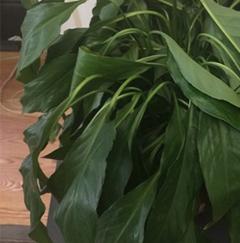

# Peace Lily Health Detection – Machine Learning Project

Peace Lily Health Detection is a small machine learning project which is able to decide whether a peace lily on a picture  needs water or not. The model has been trained with Tensorflow in Python (in combination with Google Colab) and implemented in Tensorflow.js javascript code in order to embed the model in a website.
Due to problems with using the image which could've been uploaded with an input form, this solution relies on a hardcoded image source path in the index.html.


## Installation

Set up a local webserver in order to use the website. Due to my personal preference I've been using XAMPP, which did not require any code to get a webserver started. Feel free to make some changes to get it started to your preferences. 

If you're interested in using XAMPP as well, [take a look at their website and get more information on that](https://www.apachefriends.org/de/download.html). I've been using the version without vm. 


## Usage
After downloading or cloning this project, you can open the index.html file after setting up a local webserver. You will see an image which has been embedded in the html code directly. If you want to try out other pictures which are on you local machine, you can change the image source in the following line of the html code:
```html
    
```

After choosing an image, it will be run through the model as soon as you press the button below the image. As a result, the predicted status will be shown on the screen.

You can reset your settings and go for another try by either reloading the page or press the button "Give it another try" (which simply reloads the page as well). 


## Acknowledgment
Thank you to Zaid Alyafeia for his blog post on medium on how to embed a trained model with colab can be implemented in the browser by implementing it in tensorflow.js – it helped me a lot on figuring out how to stick to javascript while working on a website instead of using programs such as flask, which require knowledge in python (since I do not have any :)). [Read the blog post here](https://medium.com/tensorflow/train-on-google-colab-and-run-on-the-browser-a-case-study-8a45f9b1474e)

Another thanks goes to Seedbank and their project on how to build a classifier model from scatch. This helped me out a lot on how to write a model in python and how to tweak it to my preferences for my model. [Take a look at the project here](https://research.google.com/seedbank/seed/cat_vs_dog_part_one)

Lastly and most importantly, thank you to Meghan Kane to lead the course at the university and provide the students and myself with a lot of interesting information on how to work on a machine learning project. Especially a lot of thanks for the time you put in this course to help us out if there were any problems. Thank you!
